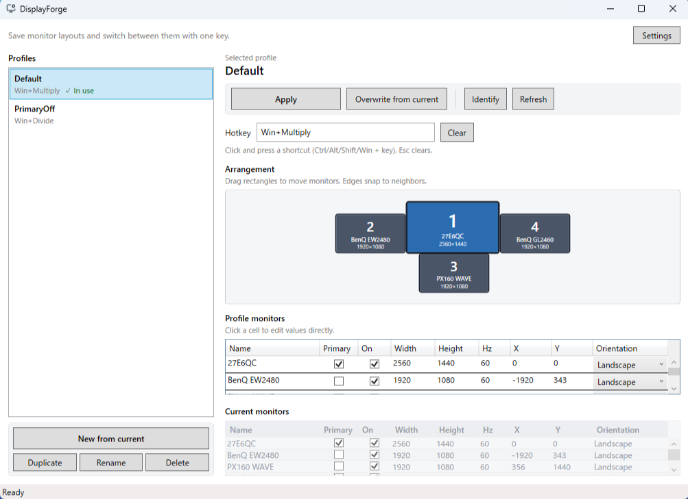
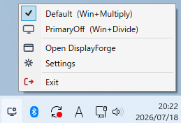

<a id="readme-top"></a>

<div align="center">

English | [日本語](./README_ja.md)

<h1>DisplayForge</h1>

<p><em>Windows multi-monitor profile switcher with per-profile hotkeys and system tray residency</em></p>

[](https://github.com/dreamingdog0529/DisplayForge/actions/workflows/ci.yml)
[](https://github.com/dreamingdog0529/DisplayForge/releases/latest)
[](LICENSE)
[](https://securityscorecards.dev/viewer/?uri=github.com/dreamingdog0529/DisplayForge)

<p>
  <a href="docs/building.md"><strong>Explore the docs »</strong></a>
  <br /><br />
  <a href="https://github.com/dreamingdog0529/DisplayForge/issues/new?template=bug_report.yml">Report Bug</a>
  ·
  <a href="https://github.com/dreamingdog0529/DisplayForge/issues/new?template=feature_request.yml">Request Feature</a>
  ·
  <a href="https://github.com/dreamingdog0529/DisplayForge/discussions">Discussions</a>
</p>

</div>

<details>
  <summary>Table of Contents</summary>
  <ol>
    <li><a href="#about">About The Project</a></li>
    <li><a href="#features">Features</a></li>
    <li>
      <a href="#getting-started">Getting Started</a>
      <ul>
        <li><a href="#prerequisites">Prerequisites</a></li>
        <li><a href="#installation">Installation</a></li>
      </ul>
    </li>
    <li>
      <a href="#usage">Usage</a>
      <ul>
        <li><a href="#supported-languages">Supported languages</a></li>
        <li><a href="#data-locations">Data locations</a></li>
      </ul>
    </li>
    <li>
      <a href="#development">Development</a>
      <ul>
        <li><a href="#architecture">Architecture overview</a></li>
      </ul>
    </li>
    <li><a href="#roadmap">Roadmap</a></li>
    <li><a href="#contributing">Contributing</a></li>
    <li><a href="#project-docs">Project Docs</a></li>
    <li><a href="#license">License</a></li>
    <li><a href="#acknowledgments">Acknowledgments</a></li>
  </ol>
</details>

<a id="about"></a>

## About The Project

Windows multi-monitor **profile switcher**. Inspired by NirSoft MultiMonitorTool’s save/restore workflow, with **per-profile global hotkeys** and **system tray residency** as first-class features.

**Main window** — profiles, hotkeys, layout editor, and monitor details



**System tray** — apply a profile, open the app, or exit from the context menu



### Built With

- [.NET 10](https://dotnet.microsoft.com/) / WPF (Windows desktop UI)
- Windows **CCD** display API (`QueryDisplayConfig` / `SetDisplayConfig`)
- [WiX Toolset](https://wixtoolset.org/) — MSI + Setup.exe bootstrapper
- [Lucide](https://lucide.dev/) — application and tray icons

<p align="right">(<a href="#readme-top">back to top</a>)</p>

<a id="features"></a>

## Features

- Save the current monitor layout as a profile
  - Enabled / disabled, primary monitor, resolution, refresh rate, orientation, position
- Apply, duplicate, delete, and rename profiles
- Assign a global hotkey per profile for instant switching
- System tray residency (apply from the context menu)
- UI localization in **31 languages** (follows the system language by default; override in **Settings**)
- Settings and profiles stored as JSON under `%AppData%\DisplayForge\`

<p align="right">(<a href="#readme-top">back to top</a>)</p>

<a id="getting-started"></a>

## Getting Started

<a id="prerequisites"></a>

### Prerequisites

- Windows 10 / 11 (x64)
- For the **MSI** package only: [.NET 10 Desktop Runtime](https://dotnet.microsoft.com/download/dotnet/10.0). The **Setup.exe** installs it automatically when missing.

<a id="installation"></a>

### Installation

**[Open the latest release](https://github.com/dreamingdog0529/DisplayForge/releases/latest)**

| Item | Details |
|------|---------|
| OS | Windows 10 / 11 (x64) |
| Recommended | **`…-Setup.exe`** (installs everything you need) |
| Also available | **`….msi`** (app only; see below) |
| Example file names | `DisplayForge-0.1.1-win-x64-en-US-Setup.exe`, `…-ja-JP-Setup.exe` |
| Settings location | `%AppData%\DisplayForge\` (kept after uninstall) |

#### Which file should I download? (Setup.exe vs MSI)

Releases include two kinds of installer. **They install the same app** — pick based on how you want to install:

| File | Who it’s for | What it does |
|------|----------------|--------------|
| **`…-Setup.exe`** (recommended) | Most people | Installs DisplayForge. If [.NET 10 Desktop Runtime](https://dotnet.microsoft.com/download/dotnet/10.0) is missing, it installs that first automatically. |
| **`….msi`** | Advanced / IT use | Installs DisplayForge only. You must already have the Desktop Runtime, or the app will not run. Handy for company deployment or silent install with `msiexec`. |

**Simple rule:** if you’re not sure, download **Setup.exe**.

- Prefer **ja-JP** or **en-US** in the file name for the *installer wizard* language (Japanese or English). The app itself supports [31 UI languages](#supported-languages) either way.
- Run the installer as administrator when Windows asks.
- If a release is not available yet, you can [build from source](docs/building.md).

<p align="right">(<a href="#readme-top">back to top</a>)</p>

<a id="usage"></a>

## Usage

1. Start the app (the main window opens by default)
2. Optionally minimize to the tray; double-click the tray icon to open the window again
3. Create a profile with **New from current layout**
4. Click the hotkey field and press a chord such as `Ctrl+Alt+1`
5. Change the Windows display layout, then save another profile the same way
6. Switch with the hotkey or the tray menu

In a normal launch, closing the window keeps the app in the tray. Use **Exit** on the tray menu to quit. Prefer tray-only startup via **Settings → Start minimized to tray**.

<a id="supported-languages"></a>

### Supported languages

#### App UI (31)

Defaults to the Windows display language. Change anytime under **Settings → Language**. Every installer package includes all of these UI languages.

> **Note:** UI strings (and most installer localizations) were produced with AI assistance. Wording may be imperfect or unnatural in places — feedback and corrections are welcome.

| Code | Language | Code | Language |
|------|----------|------|----------|
| `en` | English | `ja` | 日本語 |
| `zh-Hans` | 简体中文 | `zh-Hant` | 繁體中文 |
| `ko` | 한국어 | `de` | Deutsch |
| `fr` | Français | `es` | Español |
| `pt-BR` | Português (Brasil) | `pt-PT` | Português (Portugal) |
| `it` | Italiano | `nl` | Nederlands |
| `pl` | Polski | `ru` | Русский |
| `uk` | Українська | `tr` | Türkçe |
| `cs` | Čeština | `sv` | Svenska |
| `da` | Dansk | `nb` | Norsk bokmål |
| `fi` | Suomi | `hu` | Magyar |
| `ro` | Română | `el` | Ελληνικά |
| `vi` | Tiếng Việt | `th` | ไทย |
| `id` | Bahasa Indonesia | `ms` | Bahasa Melayu |
| `hi` | हिन्दी | `ar` | العربية |
| `he` | עברית | | |

#### Installer (Setup / MSI wizard)

GitHub Releases currently ship **en-US** and **ja-JP** Setup.exe (and MSI) packages (installer wizard language only). The app UI language set above is the same in both packages.

<a id="data-locations"></a>

### Data locations

| File | Contents |
|------|----------|
| `%AppData%\DisplayForge\profiles.json` | Profile list |
| `%AppData%\DisplayForge\settings.json` | Language, notifications, hotkey enablement, etc. |

<p align="right">(<a href="#readme-top">back to top</a>)</p>

<a id="development"></a>

## Development

Requirements: Windows 10/11 x64, [.NET 10 SDK](https://dotnet.microsoft.com/download)

```powershell
dotnet build
dotnet test
dotnet run --project src/DisplayForge
```

Build installers locally (Setup.exe + MSI):

```powershell
.\build-msi.ps1
```

Full build, silent install, CI/release notes: **[docs/building.md](docs/building.md)**
How to contribute: **[CONTRIBUTING.md](CONTRIBUTING.md)**

<a id="architecture"></a>

### Architecture overview

```
src/DisplayForge                 WPF UI / tray / hotkeys
src/DisplayForge.Core            Display API, profiles, matching
tests/DisplayForge.Core.Tests
installer/DisplayForge.Installer WiX MSI
installer/DisplayForge.Bootstrapper WiX Bundle (Setup.exe)
```

Display changes use the Windows **CCD** API (`QueryDisplayConfig` / `SetDisplayConfig`).
The primary monitor is treated as the virtual-desktop origin `(0,0)`.

With `dotnet run`, closing the window also exits the process (so the shell is not left blocked). To keep tray residency while developing:

```powershell
dotnet run --project src/DisplayForge -- --tray-on-close
```

To exit on close even in a normal launch, pass `--exit-on-close`.

<p align="right">(<a href="#readme-top">back to top</a>)</p>

<a id="roadmap"></a>

## Roadmap

See the [open issues](https://github.com/dreamingdog0529/DisplayForge/issues) and
[ROADMAP.md](ROADMAP.md) for planned features and known issues.

**Known limitations:**

- Aimed at extended desktop (Extend). Advanced clone-only editing is not supported
- When a monitor is disconnected, that profile entry is skipped (partial apply)
- On some Windows 11 setups `SetDisplayConfig` can be flaky; if apply fails, open Windows Display Settings once and try again
- DPI scaling / HDR / window position restore are candidates for future work

<p align="right">(<a href="#readme-top">back to top</a>)</p>

<a id="contributing"></a>

## Contributing

Contributions are welcome. Please read **[CONTRIBUTING.md](CONTRIBUTING.md)** for the
workflow (Conventional Commits, DCO sign-off, PR process) and our
[Code of Conduct](CODE_OF_CONDUCT.md).

Thanks to everyone who has contributed to DisplayForge. This list is updated automatically from git history.

<!-- readme: contributors -start -->
<table>
	<tbody>
		<tr>
            <td align="center">
                <a href="https://github.com/dreamingdog0529">
                    
                    <br />
                    <sub><b>dreamingdog0529</b></sub>
                </a>
            </td>
		</tr>
	<tbody>
</table>
<!-- readme: contributors -end -->

<p align="right">(<a href="#readme-top">back to top</a>)</p>

<a id="project-docs"></a>

## Project Docs

Repository automation and community files follow
[container-registry/oss-project-template](https://github.com/container-registry/oss-project-template)
(adapted for .NET / Windows installers).

| Document | Purpose |
|----------|---------|
| [CONTRIBUTING.md](CONTRIBUTING.md) | Develop, test, PRs, DCO, CI/CD, releases |
| [SUPPORT.md](SUPPORT.md) | How to get help |
| [ROADMAP.md](ROADMAP.md) | Direction and how to propose work |
| [CODE_OF_CONDUCT.md](CODE_OF_CONDUCT.md) | Community standards |
| [SECURITY.md](SECURITY.md) | Private vulnerability reporting |
| [CODEOWNERS](CODEOWNERS) | Default code review owners |
| [CHANGELOG.md](CHANGELOG.md) | Release history |
| [LICENSE](LICENSE) | MIT license text |

<p align="right">(<a href="#readme-top">back to top</a>)</p>

<a id="license"></a>

## License

Distributed under the MIT License. See [LICENSE](LICENSE) for more information.

MIT © 2026 DisplayForge contributors

<p align="right">(<a href="#readme-top">back to top</a>)</p>

<a id="acknowledgments"></a>

## Acknowledgments

- [NirSoft MultiMonitorTool](https://www.nirsoft.net/utils/multi_monitor_tool.html) — the save/restore workflow that inspired this project
- [Lucide](https://lucide.dev/) ([ISC License](https://lucide.dev/license)) — application and tray icons
  - App / tray indicator: `monitor-cog` (source SVG under `src/DisplayForge/Assets/lucide/`; packaged as `Assets/app.ico`)
  - Tray menu: `monitor`, `check`, `settings`, `app-window`, `log-out` (same folder)
  - Full license text: `src/DisplayForge/Assets/LICENSES/lucide-LICENSE.txt`
- [container-registry/oss-project-template](https://github.com/container-registry/oss-project-template) — automation and community files
- [Best-README-Template](https://github.com/othneildrew/Best-README-Template) — README structure
- [Shields.io](https://shields.io/) — badges

<p align="right">(<a href="#readme-top">back to top</a>)</p>
